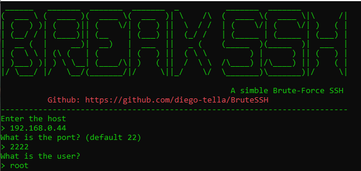

# BruteSSH
A simple Brute-Force for SSH developed in C#.<br>


## Objective
This program was developed for study purposes only and to learn that, even using C#, a Microsoft language, it is still possible to create pentest programs that can attack Linux SSH servers and that it is possible to connect with them.<br>
The program is constantly updated.

## Use
You can download the zip file here and unzip it on your computer. 
<br>Access:
```
BruteSSH/Brute SSH/bin/Debug/netcoreapp3.1/
```
To run the program.<br><br>
To run the program correctly, just follow the steps that the program asks for, such as the host and the port that runs the SSH service.

<br>
<h1>Wordlist</h1>
There is a simple wordlist in the executable directory that can help you, in case you don't have any wordlist available. Still, you can choose which wordlist you want, passing the path, as shown below:

If you want to use the default wordlist in the directory, jtst press the enter key, you will not need to write the path again.
